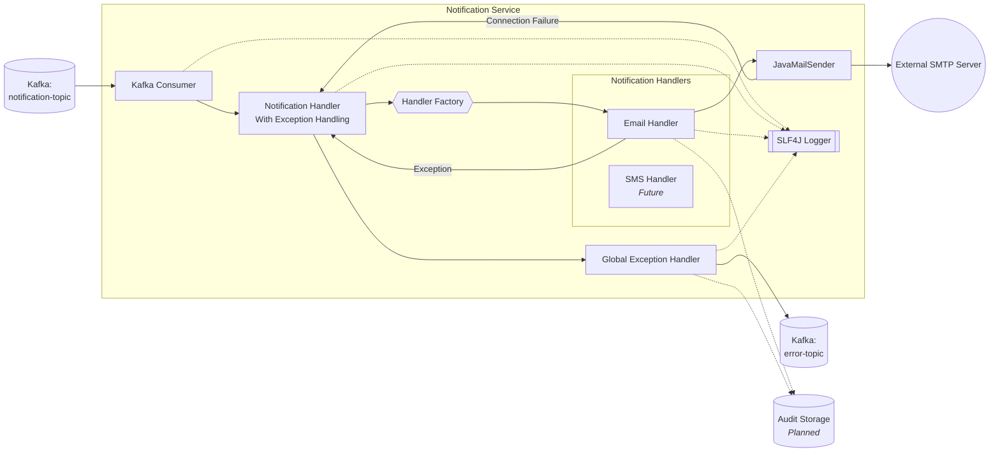

# Notification Service — Event-Driven Alerting Microservice

A production-style event-driven notification microservice built using Java 21, Spring Boot, and Apache Kafka.

This project demonstrates scalable asynchronous backend processing using Kafka-driven messaging workflows, extensible notification strategies, polymorphic event handling, centralized exception management, and modern Java concurrency patterns.

The service consumes notification events from Kafka topics and dynamically routes them to channel-specific handlers such as Email, with extensibility support for SMS, Push, Slack, and future notification providers.

---

# 🚀 Engineering Highlights

* Event-driven microservice architecture using Apache Kafka
* Strategy pattern–based notification routing
* Polymorphic DTO/event processing using Jackson
* Centralized exception handling & DLQ support
* Java 21 Virtual Threads for scalable I/O handling
* Extensible multi-channel notification framework
* Clean separation of consumer, routing, and delivery layers
* Configurable environment-driven architecture

---

# 🏗️ System Architecture



---

# 🧠 Key Design Decisions

## Strategy Pattern

Notification delivery is abstracted using the Strategy Pattern to decouple Kafka consumption from channel-specific delivery logic.

This allows new notification channels (Slack, WhatsApp, Push, SMS, etc.) to be added with minimal changes to the existing architecture while maintaining Open/Closed Principle compliance.

---

## Polymorphic Event Processing

Implemented using Jackson `@JsonTypeInfo` and `@JsonSubTypes` to support multiple notification event types through a shared Kafka topic.

This approach enables:

* flexible event evolution,
* simplified topic management,
* and scalable event routing.

---

## Centralized Exception Handling

A dedicated exception-handling wrapper manages:

* delivery failures,
* retry workflows,
* DLQ routing,
* and structured logging.

This improves resiliency and operational observability.

---

## Java 21 Virtual Threads

Virtual Threads are used for I/O-heavy notification workflows such as SMTP communication to improve throughput while avoiding traditional thread-pool bottlenecks.

---

# ⚙️ Technology Stack

* Java 21
* Spring Boot
* Apache Kafka
* Spring Kafka
* JavaMailSender
* Jackson
* Gradle
* SLF4J Logging

---

# ⚙️ Configuration Example

```yaml
spring:
  kafka:
    bootstrap-servers: localhost:9092

app:
  kafka:
    topic: notification-topic
```

---

# 📩 Example Notification Events

## Email Notification

```json
{
  "notificationType": "EMAIL",
  "from": "no-reply@myapp.com",
  "to": "user@example.com",
  "subject": "Welcome!",
  "body": "Hello User, welcome to our service",
  "attachments": []
}
```

---

## SMS Notification

```json
{
  "notificationType": "SMS",
  "phoneNumber": "+1234567890",
  "message": "Your OTP is 123456"
}
```

---

# ▶️ Running the Application

## Start Kafka

```bash
localhost:9092
```

## Build the project

```bash
./gradlew build
```

## Run the application

```bash
./gradlew bootRun
```

## Publish events

Send notification JSON payloads to the configured Kafka topic.

The Notification Service automatically routes events to the correct delivery handler.

---

# 🔮 Future Enhancements

* Retry policies with exponential backoff
* Notification audit persistence
* Slack/WhatsApp integrations
* Kubernetes deployment manifests
* Observability with Prometheus & Grafana
* OpenTelemetry tracing
* Authentication & rate limiting
* Template-driven notifications

---

# 👨‍💻 Purpose of This Project

This project was built as part of my professional re-entry engineering portfolio to demonstrate modern Java backend development practices, event-driven microservices, asynchronous processing patterns, and scalable distributed system design.
