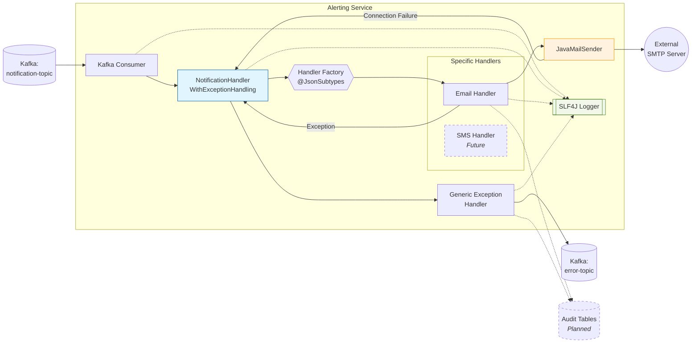

# Notification Service Microservice

A **Spring Boot** microservice that consumes notification events from a **Kafka topic** and sends notifications via multiple channels (Email, SMS, Push).
This project demonstrates **event-driven architecture**, **polymorphic DTO design**, and **clean, extensible service patterns**.

---

## 🔹 Features

- Event-driven notification handling using **Apache Kafka**.
- Supports **Email** notifications with:
  - From, To, Subject, Body, Attachments.
- Polymorphic **NotificationEventMessage** DTO:
  - Extendable for SMS, Push, and future channels.
- **Strategy pattern** to handle multiple notification types.
- Configurable via **application.yml**:
  - Kafka bootstrap servers, topic name, consumer group.
  - Email defaults and properties.
- JSON serialization/deserialization using **Jackson**.

---
## System Architecture

---
## 🧠 Design Decisions & Patterns
Strategy Pattern: Used to decouple the Kafka Consumer from the delivery logic. This ensures that adding a new channel (like Slack or WhatsApp) requires zero changes to the consumer code, adhering to the Open/Closed Principle.

Polymorphic JSON Handling: Leveraging Jackson's @JsonTypeInfo and @JsonSubTypes to handle diverse payloads within a single Kafka topic. This demonstrates a "Single Topic, Multiple Event Types" approach, reducing infrastructure overhead.

Dead Letter Queue (DLQ): Implemented via the Kafka error-topic.

Centralized Error Handling: Managed by the NotificationHandlerWithExceptionHandling wrapper.

Virtual Threads (Java 21): Leveraged Java 21 Virtual Threads to handle I/O-bound notification tasks (like SMTP calls), ensuring high throughput without thread-pool exhaustion.

## 📂 Project Structure


---

## ⚙️ Configuration

### `application.yml` example

```yaml
spring:
  kafka:
    bootstrap-servers: localhost:9092
    consumer:
      group-id: notification-group
      auto-offset-reset: earliest
      key-deserializer: org.apache.kafka.common.serialization.StringDeserializer
      value-deserializer: org.springframework.kafka.support.serializer.JsonDeserializer

  mail:
    host: smtp.gmail.com
    port: 587
    username: your-email@gmail.com
    password: your-password
    properties:
      mail.smtp.auth: true
      mail.smtp.starttls.enable: true

app:
  kafka:
    topic: my-topic
  email:
    from: no-reply@myapp.com
    default-subject: Notification
    retry-attempts: 3

 ---
 ## Example Notification Event
 Email Notification
 {
   "notificationType": "EMAIL",
   "from": "no-reply@myapp.com",
   "to": "user@example.com",
   "subject": "Welcome!",
   "body": "Hello User, welcome to our service",
    "attachments": []
 }

SMS Notification
 {
   "notificationType": "SMS",
   "phoneNumber": "+1234567890",
   "message": "Your OTP is 123456"
 }


Usage
Start Kafka on localhost:9092.
Build the project with Gradle:
./gradlew build
Run the Spring Boot application:
./gradlew bootRun
Produce JSON messages to Kafka topic (my-topic).
NotificationService automatically routes the event to the correct handler.


Extensibility
Add new notification channels by creating a subclass of NotificationEventMessage.
Implement a NotificationHandler service for the new type.
The strategy pattern automatically routes messages based on NotificationType.
Polymorphic DTOs (@JsonTypeInfo, @JsonSubTypes) ensure clean JSON mapping.

Tech Stack
Java 21
Spring Boot 4.x
Spring Kafka
Spring Mail / JavaMailSender
Jackson for JSON serialization/deserialization
Gradle build system
Kafka (local or cluster)
